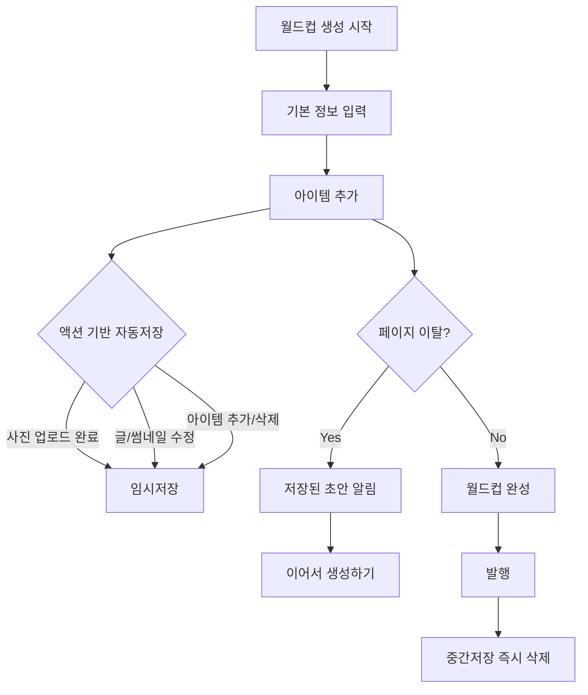
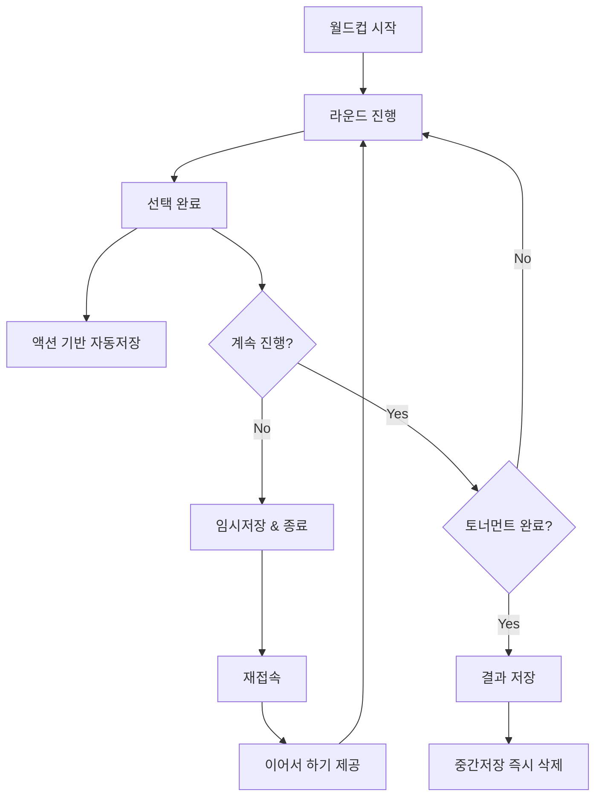

# 월드컵 중간저장 기능 설계서 (개정판)

## 📋 개요

월드컵 생성과 플레이 과정에서 사용자 편의성을 높이기 위한 **액션 기반 중간저장** 기능 설계
- Supabase 중심의 단순하고 안정적인 아키텍처
- 네트워크 부하 최소화 및 사용자 액션에 따른 스마트 저장

## 🎯 핵심 요구사항

### 1. 월드컵 생성자 중간저장
- 월드컵 생성 중 임시저장 기능
- 페이지 이탈 시 데이터 보존
- 이어서 생성하기 기능

### 2. 월드컵 플레이어 중간저장  
- 토너먼트 진행 중 중간저장
- 회원/비회원 모두 지원
- 이어서 플레이하기 기능

### 3. 단순한 데이터 라이프사이클
- **완료 시 중간저장 즉시 삭제** (월드컵 발행 또는 플레이 완료 시)
- Supabase DB + Storage 통합 관리
- 복잡한 캐싱이나 로컬 저장 없음

## 🗄️ 데이터베이스 스키마

### worldcup_draft_saves (월드컵 생성 중간저장)

```sql
CREATE TABLE worldcup_draft_saves (
    id UUID PRIMARY KEY DEFAULT gen_random_uuid(),
    user_id UUID NOT NULL REFERENCES auth.users(id),
    title TEXT,
    description TEXT,
    category VARCHAR(50),
    items JSONB DEFAULT '[]'::jsonb,
    settings JSONB DEFAULT '{}'::jsonb,
    image_files JSONB DEFAULT '[]'::jsonb, -- Supabase Storage 파일 경로들
    created_at TIMESTAMP WITH TIME ZONE DEFAULT NOW(),
    updated_at TIMESTAMP WITH TIME ZONE DEFAULT NOW()
);

-- 인덱스
CREATE INDEX idx_worldcup_draft_saves_user_id ON worldcup_draft_saves(user_id);
CREATE INDEX idx_worldcup_draft_saves_updated_at ON worldcup_draft_saves(updated_at);
```

### worldcup_play_saves (월드컵 플레이 중간저장)

```sql
CREATE TABLE worldcup_play_saves (
    id UUID PRIMARY KEY DEFAULT gen_random_uuid(),
    user_id UUID REFERENCES auth.users(id), -- NULL 가능 (비회원)
    worldcup_id UUID NOT NULL REFERENCES worldcups(id),
    session_id VARCHAR(128), -- 비회원 식별용
    current_round INTEGER NOT NULL,
    total_rounds INTEGER NOT NULL,
    bracket_state JSONB NOT NULL,
    remaining_items JSONB NOT NULL DEFAULT '[]'::jsonb,
    selected_items JSONB NOT NULL DEFAULT '[]'::jsonb,
    round_history JSONB NOT NULL DEFAULT '[]'::jsonb,
    created_at TIMESTAMP WITH TIME ZONE DEFAULT NOW(),
    updated_at TIMESTAMP WITH TIME ZONE DEFAULT NOW(),
    expires_at TIMESTAMP WITH TIME ZONE DEFAULT (NOW() + INTERVAL '7 days')
);

-- 인덱스
CREATE INDEX idx_worldcup_play_saves_user_id ON worldcup_play_saves(user_id);
CREATE INDEX idx_worldcup_play_saves_worldcup_id ON worldcup_play_saves(worldcup_id);
CREATE INDEX idx_worldcup_play_saves_session_id ON worldcup_play_saves(session_id);
CREATE INDEX idx_worldcup_play_saves_expires_at ON worldcup_play_saves(expires_at);
```

## 🔄 사용자 시나리오

### 월드컵 생성자 플로우



### 월드컵 플레이어 플로우



## 🛠️ 기술 구현

### 프론트엔드

#### React Hooks (액션 기반)

```typescript
// useActionAutoSave.ts - 액션 기반 자동저장
export const useActionAutoSave = <T>(
  data: T,
  saveFunction: (data: T) => Promise<void>,
  options: {
    debounceMs?: number;
    enabled?: boolean;
  } = {}
) => {
  const { debounceMs = 500, enabled = true } = options;
  const [saveStatus, setSaveStatus] = useState<'idle' | 'saving' | 'saved' | 'error'>('idle');
  
  const debouncedSave = useMemo(
    () => debounce(async (data: T) => {
      if (!enabled) return;
      
      setSaveStatus('saving');
      try {
        await saveFunction(data);
        setSaveStatus('saved');
        // 2초 후 상태 초기화
        setTimeout(() => setSaveStatus('idle'), 2000);
      } catch (error) {
        setSaveStatus('error');
        console.error('Auto-save failed:', error);
      }
    }, debounceMs),
    [saveFunction, debounceMs, enabled]
  );

  const triggerSave = useCallback(() => {
    if (data && enabled) {
      debouncedSave(data);
    }
  }, [data, enabled, debouncedSave]);

  return { triggerSave, saveStatus };
};

// useDraftRestore.ts
export const useDraftRestore = (
  restoreFunction: () => Promise<any>
) => {
  const [hasDraft, setHasDraft] = useState(false);
  const [isRestoring, setIsRestoring] = useState(false);

  useEffect(() => {
    checkForDraft();
  }, []);

  const checkForDraft = async () => {
    try {
      const draft = await restoreFunction();
      setHasDraft(!!draft);
    } catch (error) {
      console.error('Draft check failed:', error);
    }
  };

  const restoreDraft = async () => {
    setIsRestoring(true);
    try {
      return await restoreFunction();
    } finally {
      setIsRestoring(false);
    }
  };

  return { hasDraft, isRestoring, restoreDraft };
};
```

#### 액션 기반 저장 컴포넌트

```typescript
// ActionSaveProvider.tsx
export const ActionSaveProvider: React.FC<{
  children: React.ReactNode;
  data: any;
  saveEndpoint: string;
  enabled?: boolean;
}> = ({ children, data, saveEndpoint, enabled = true }) => {
  const saveData = useCallback(async (data: any) => {
    try {
      const response = await fetch(saveEndpoint, {
        method: 'POST',
        headers: { 'Content-Type': 'application/json' },
        body: JSON.stringify(data)
      });
      
      if (!response.ok) {
        throw new Error(`Save failed: ${response.statusText}`);
      }
      
      console.log('Action-based save successful');
    } catch (error) {
      console.error('Save failed:', error);
      // 재시도 로직 (최대 3회)
      throw error;
    }
  }, [saveEndpoint]);

  const { triggerSave, saveStatus } = useActionAutoSave(data, saveData, { enabled });

  return (
    <ActionSaveContext.Provider value={{ triggerSave, saveStatus }}>
      {children}
    </ActionSaveContext.Provider>
  );
};

// 저장 트리거 Hook
export const useSaveTrigger = () => {
  const context = useContext(ActionSaveContext);
  if (!context) {
    throw new Error('useSaveTrigger must be used within ActionSaveProvider');
  }
  return context;
};
```

### 백엔드 API

#### Supabase 중심 저장 API

```typescript
// /api/drafts/save
export async function POST(request: Request) {
  try {
    const { type, data, action } = await request.json();
    const userId = await getUserId(request);
    
    console.log(`Action-based save triggered: ${action}`); // 디버깅용
    
    if (type === 'worldcup_creation') {
      await saveDraftWorldCup(userId, data);
    } else if (type === 'worldcup_play') {
      await savePlayProgress(userId, data);
    }
    
    return NextResponse.json({ 
      success: true, 
      timestamp: new Date().toISOString() 
    });
  } catch (error) {
    console.error('Save failed:', error);
    return NextResponse.json(
      { error: 'Save failed', details: error.message }, 
      { status: 500 }
    );
  }
}

// Supabase 저장 함수
async function saveDraftWorldCup(userId: string, data: any) {
  const { error } = await supabase
    .from('worldcup_draft_saves')
    .upsert({
      user_id: userId,
      title: data.title,
      description: data.description,
      category: data.category,
      items: data.items,
      settings: data.settings,
      image_files: data.imageFiles || [],
      updated_at: new Date().toISOString()
    }, {
      onConflict: 'user_id'
    });

  if (error) throw error;
}

// 완료 시 즉시 삭제
async function deleteDraftOnCompletion(userId: string, type: 'creation' | 'play', worldcupId?: string) {
  if (type === 'creation') {
    await supabase
      .from('worldcup_draft_saves')
      .delete()
      .eq('user_id', userId);
  } else {
    await supabase
      .from('worldcup_play_saves')
      .delete()
      .eq('user_id', userId)
      .eq('worldcup_id', worldcupId);
  }
}

// /api/drafts/restore
export async function GET(request: Request) {
  try {
    const { searchParams } = new URL(request.url);
    const type = searchParams.get('type');
    const userId = await getUserId(request);
    
    let draft = null;
    if (type === 'worldcup_creation') {
      draft = await getDraftWorldCup(userId);
    } else if (type === 'worldcup_play') {
      const worldcupId = searchParams.get('worldcupId');
      draft = await getPlayProgress(userId, worldcupId);
    }
    
    return NextResponse.json({ draft });
  } catch (error) {
    return NextResponse.json(
      { error: 'Restore failed' }, 
      { status: 500 }
    );
  }
}
```

## 📱 마이페이지 구성

### 탭 구조

```typescript
const MyPageTabs = [
  {
    id: 'my-worldcups',
    title: '내 월드컵',
    description: '내가 만든 월드컵들'
  },
  {
    id: 'drafts',
    title: '임시저장',
    description: '생성 중인 월드컵 초안들',
    badge: draftCount > 0 ? draftCount : undefined
  },
  {
    id: 'in-progress',
    title: '진행 중',
    description: '플레이 중인 월드컵들',
    badge: progressCount > 0 ? progressCount : undefined
  },
  {
    id: 'completed',
    title: '완료 기록',
    description: '플레이 완료한 월드컵들'
  },
  {
    id: 'bookmarks',
    title: '북마크',
    description: '저장한 월드컵들'
  }
];
```

### UI 컴포넌트

```tsx
// DraftCard.tsx
const DraftCard: React.FC<{
  draft: DraftWorldCup;
  onContinue: (id: string) => void;
  onDelete: (id: string) => void;
}> = ({ draft, onContinue, onDelete }) => {
  return (
    <div className="border rounded-lg p-4 bg-yellow-50 border-yellow-200">
      <div className="flex justify-between items-start mb-2">
        <h3 className="font-semibold text-gray-900">
          {draft.title || '제목 없음'}
        </h3>
        <span className="text-xs text-gray-500">
          {formatRelativeTime(draft.updated_at)}
        </span>
      </div>
      
      <p className="text-sm text-gray-600 mb-3">
        아이템 {draft.items?.length || 0}개 추가됨
      </p>
      
      <div className="flex gap-2">
        <button
          onClick={() => onContinue(draft.id)}
          className="flex-1 bg-blue-600 text-white px-3 py-2 rounded text-sm hover:bg-blue-700"
        >
          이어서 만들기
        </button>
        <button
          onClick={() => onDelete(draft.id)}
          className="px-3 py-2 border border-red-300 text-red-600 rounded text-sm hover:bg-red-50"
        >
          삭제
        </button>
      </div>
    </div>
  );
};

// ProgressCard.tsx  
const ProgressCard: React.FC<{
  progress: PlayProgress;
  onContinue: (worldcupId: string) => void;
  onDelete: (id: string) => void;
}> = ({ progress, onContinue, onDelete }) => {
  const progressPercent = (progress.current_round / progress.total_rounds) * 100;
  
  return (
    <div className="border rounded-lg p-4 bg-green-50 border-green-200">
      <div className="flex justify-between items-start mb-2">
        <h3 className="font-semibold text-gray-900">
          {progress.worldcup.title}
        </h3>
        <span className="text-xs text-gray-500">
          {formatRelativeTime(progress.updated_at)}
        </span>
      </div>
      
      <div className="mb-3">
        <div className="flex justify-between text-sm text-gray-600 mb-1">
          <span>{progress.current_round}라운드 진행 중</span>
          <span>{Math.round(progressPercent)}%</span>
        </div>
        <div className="w-full bg-gray-200 rounded-full h-2">
          <div
            className="bg-green-600 h-2 rounded-full"
            style={{ width: `${progressPercent}%` }}
          />
        </div>
      </div>
      
      <div className="flex gap-2">
        <button
          onClick={() => onContinue(progress.worldcup_id)}
          className="flex-1 bg-green-600 text-white px-3 py-2 rounded text-sm hover:bg-green-700"
        >
          이어서 하기
        </button>
        <button
          onClick={() => onDelete(progress.id)}
          className="px-3 py-2 border border-red-300 text-red-600 rounded text-sm hover:bg-red-50"
        >
          삭제
        </button>
      </div>
    </div>
  );
};
```

## ⚙️ 액션 기반 자동저장 설정

### 트리거 조건 (시간 기반 자동저장 제거)

| 액션 | 생성자 | 플레이어 | Debounce |
|------|--------|----------|----------|
| **주요 액션** | 사진 업로드 완료, 썸네일 수정 | 매 선택 완료, 라운드 완료 | 즉시 |
| **텍스트 수정** | 제목/설명 수정 | - | 500ms |
| **구조 변경** | 아이템 추가/삭제 | - | 300ms |
| **페이지 이탈** | beforeunload 이벤트 | beforeunload 이벤트 | 즉시 |

### Supabase 저장 최적화

```typescript
// 이미지 파일 Supabase Storage 업로드
const uploadImageToSupabase = async (file: File, userId: string) => {
  const fileName = `${userId}/${Date.now()}-${file.name}`;
  
  const { data, error } = await supabase.storage
    .from('worldcup-images')
    .upload(fileName, file);
    
  if (error) throw error;
  return data.path;
};

// 중복 제거 (복잡한 압축 로직 제거)
const deduplicateItems = (items: any[]) => {
  return items.filter((item, index, self) => 
    index === self.findIndex(i => i.id === item.id)
  );
};

// 간단한 크기 제한 검증
const validateDataSize = (data: any, maxSize = 5 * 1024 * 1024) => {
  const size = JSON.stringify(data).length;
  if (size > maxSize) {
    throw new Error(`Data size exceeds limit: ${size} bytes`);
  }
};

// 저장 상태 UI 컴포넌트
const SaveStatusIndicator: React.FC<{ status: SaveStatus }> = ({ status }) => {
  const getStatusDisplay = () => {
    switch (status) {
      case 'saving':
        return { icon: '⏳', text: '저장 중...', color: 'text-blue-600' };
      case 'saved':
        return { icon: '✅', text: '저장됨', color: 'text-green-600' };
      case 'error':
        return { icon: '❌', text: '저장 실패', color: 'text-red-600' };
      default:
        return null;
    }
  };

  const display = getStatusDisplay();
  if (!display) return null;

  return (
    <div className={`flex items-center gap-1 text-sm ${display.color}`}>
      <span>{display.icon}</span>
      <span>{display.text}</span>
    </div>
  );
};
```

## 🧹 데이터 정리

### 간소화된 정리 작업

```sql
-- 만료된 플레이 중간저장 삭제 (7일 후) - 비회원용
DELETE FROM worldcup_play_saves 
WHERE expires_at < NOW();

-- 오래된 생성 중간저장 삭제 (30일 후)
DELETE FROM worldcup_draft_saves 
WHERE updated_at < NOW() - INTERVAL '30 days';

-- ⭐ 핵심: 완료 즉시 삭제 (복잡한 배치 작업 불필요)
-- 월드컵 발행 시
DELETE FROM worldcup_draft_saves WHERE user_id = $1;

-- 플레이 완료 시  
DELETE FROM worldcup_play_saves 
WHERE user_id = $1 AND worldcup_id = $2;
```

### 단순화된 정리 스케줄러

```typescript
// cleanup-job.ts - 최소한의 정리 작업만
export async function cleanupExpiredSaves() {
  try {
    // 만료된 비회원 플레이 저장 기록만 삭제
    const { error: playError } = await supabase
      .from('worldcup_play_saves')
      .delete()
      .lt('expires_at', new Date().toISOString());

    // 오래된 생성 저장 기록 삭제 (30일)
    const expiredDate = new Date();
    expiredDate.setDate(expiredDate.getDate() - 30);
    
    const { error: draftError } = await supabase
      .from('worldcup_draft_saves')
      .delete()
      .lt('updated_at', expiredDate.toISOString());

    if (playError) console.error('Play saves cleanup failed:', playError);
    if (draftError) console.error('Draft saves cleanup failed:', draftError);

    console.log('Minimal cleanup completed');
  } catch (error) {
    console.error('Cleanup failed:', error);
  }
}

// 주 1회 실행으로 충분 (완료 즉시 삭제가 주요 정리 메커니즘)
```

## 📊 개발 우선순위

### Phase 1 (High Priority) - 2-3주
- [ ] `worldcup_play_saves` 테이블 생성
- [ ] 플레이 중간저장 API 구현
- [ ] 자동저장 React Hook 개발
- [ ] "이어서 하기" 기능 구현
- [ ] 기본적인 데이터 정리 작업

**예상 효과:** 사용자 이탈 시 진행 상황 보존, 사용자 만족도 향상

### Phase 2 (Medium Priority) - 1-2주  
- [ ] `worldcup_draft_saves` 테이블 생성
- [ ] 월드컵 생성 중간저장 구현
- [ ] 수동저장 버튼 추가
- [ ] 마이페이지 "임시저장", "진행 중" 탭 구현
- [ ] 저장 데이터 압축 및 최적화

**예상 효과:** 월드컵 생성 편의성 향상, 데이터 손실 방지

### Phase 3 (Nice to Have) - 1-2주
- [ ] 오프라인 지원 (Service Worker)
- [ ] 고급 복구 옵션 (버전 히스토리)
- [ ] 저장 통계 및 분석
- [ ] 다중 디바이스 동기화
- [ ] 백업 및 복원 기능

**예상 효과:** 고급 사용자 경험, 차별화된 기능

## 🔒 보안 고려사항

### 데이터 격리
- 사용자별 데이터 접근 제한
- 세션 검증을 통한 비회원 데이터 보호
- SQL 인젝션 방지

### 데이터 검증
```typescript
const validateDraftData = (data: any) => {
  const schema = z.object({
    title: z.string().max(200).optional(),
    description: z.string().max(1000).optional(),
    category: z.string().max(50).optional(),
    items: z.array(z.object({
      id: z.string(),
      name: z.string().max(100),
      image: z.string().url().optional()
    })).max(64) // 최대 64개 아이템
  });
  
  return schema.parse(data);
};
```

### 속도 제한
```typescript
// 저장 요청 속도 제한 (사용자당 분당 60회)
const rateLimiter = rateLimit({
  windowMs: 60 * 1000,
  max: 60,
  keyGenerator: (req) => req.user?.id || req.ip
});
```

## 📈 성능 최적화

### 데이터베이스 최적화
- JSONB 필드에 GIN 인덱스 추가
- 파티셔닝으로 대용량 데이터 처리
- 연결 풀링으로 데이터베이스 부하 관리

### 단순화된 성능 전략
- Supabase Edge Functions로 빠른 응답
- 액션 기반 저장으로 불필요한 요청 제거
- Debouncing으로 연속 액션 최적화
- Supabase Storage CDN 활용

---

## 🎯 결론 (개정판)

**핵심 설계 원칙:**
- ✅ **액션 기반 저장**: 시간 기반 제거로 네트워크 부하 최소화
- ✅ **Supabase 중심**: Redis, Local Storage 없이 단순하고 안정적인 구조
- ✅ **즉시 삭제**: 완료 시 중간저장 즉시 제거로 깔끔한 데이터 관리
- ✅ **사용자 피드백**: 저장 상태 실시간 표시로 투명한 UX

**주요 개선사항:**
1. **네트워크 효율성**: 필요한 순간에만 저장 요청
2. **아키텍처 단순화**: 복잡한 캐싱 계층 제거
3. **데이터 일관성**: 단일 데이터 소스로 충돌 방지
4. **비용 최적화**: Supabase Storage + 즉시 삭제로 비용 절약

이 개정된 설계를 통해 사용자는 안심하고 월드컵을 생성하고 플레이할 수 있으며, 시스템은 더 안정적이고 효율적으로 운영됩니다.